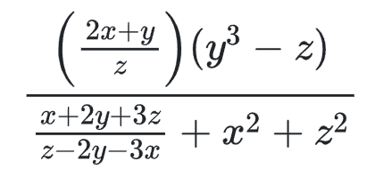

# Ejercicio: Evaluando una fórmula gigante

- **Dificultad:** Fácil
- **Fecha de publicación:** 12/7/2020
- **Fuente:** UAM Azcapotzalco 2020

### Descripcion:
Tu profesor de matemáticas quiere reprobarte y de tarea te pone a evaluar fórmulas cada vez más grandes y complicadas. Afortunadamente, aprendiste un poco de computación en la universidad y estás usando la computadora para obtener las respuestas correctas y ganarle a tu profesor. La última fórmula que tu profesor de matemáticas te dejó de tarea es la siguiente:

### Entrada:
Tres reales **x, y, z**. Puedes suponer que **1 <= x,y,z <= 100** y que jamás ocurren divisiones entre 0

### Salida:
Un real que sea el valor de la fórmula. Tu programa se considerará correcto si el valor calculado es razonablemente cercano a la respuesta exacta.

### Ejemplo:
| **ENTRADA** | **SALIDA** |
| --- | --- |
| 1.5 3 4.5 | 1.578947 |

[Prueba el problema en OmegaUp](https://omegaup.com/arena/problem/El-perrito-que-quiere-un-hueso/#problems)

---

Si deseas contactarme, puedes encontrarme en **[Twitter](https://twitter.com/SebasTorresDev)**.